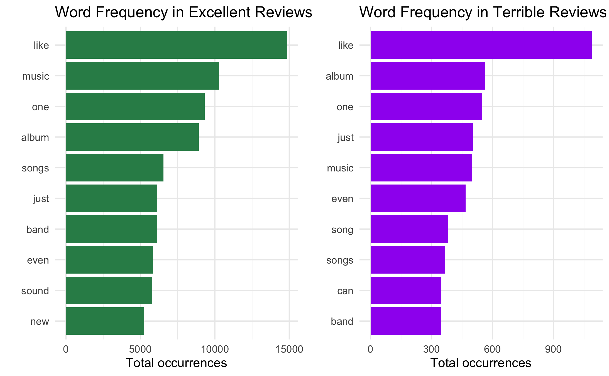
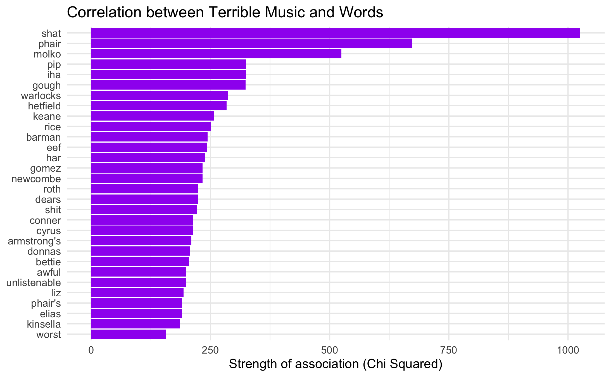
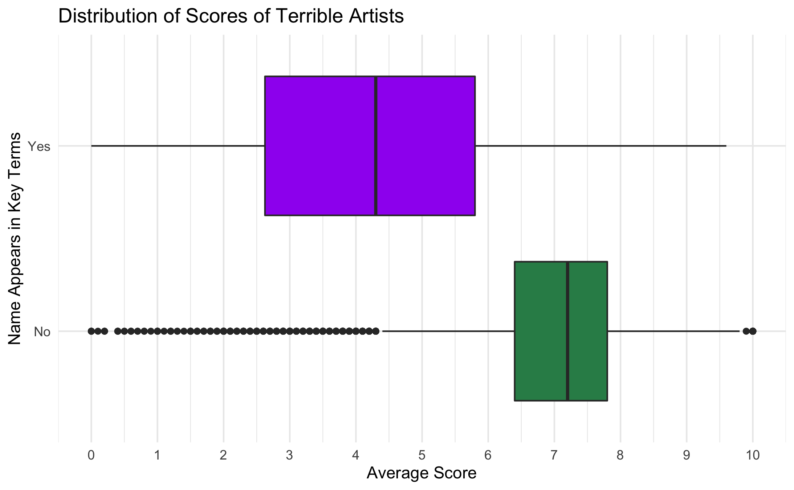
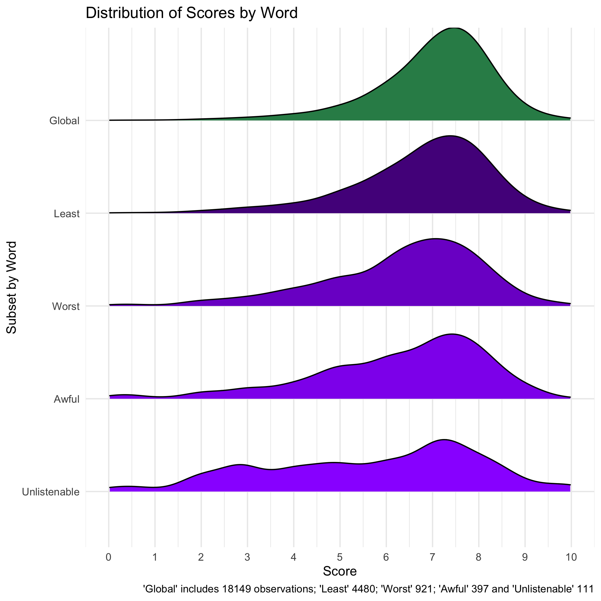
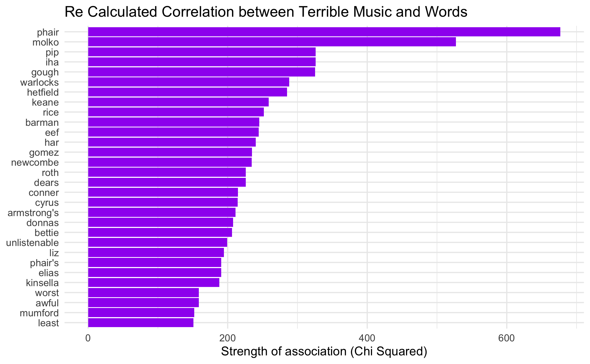

---
output:
  html_document: default
  pdf_document: default
---

## <span style="color: gray15;">**The Language of Pitchfork Music Reviews**</span>

### <span style="color: gray15;">**Project Contributors**</span>
Jose de Los Heros (j.de-los-heros@mpp.hertie-school.org):

Responsible for: 

*   Getting, wrangling and merging data

*   Word frequencies

*   *Terrible* music analysis 


Himanshi Gautam (h.gautam@mpp.hertie-school.org):

Responsible for: 

*   Word count analysis

*   *Excellent* music analysis 

*   Assembling report and aesthetics  

We are jointly responsible for writing the introduction, research questions, data, conclusion and executive summary section of the report. 

### <span style="color: gray15;">**Executive Summary**</span>

```
We are broadly interested in answering the question: how does lanugage differ across reviews of good and bad music on Pitchfork? To that end, we look at different features of the reviews: their length in characters, the frequencies of words, and the terms most closely associated with both types of review. In the end, we find that excellent reviews tend to be longer. Qualitatively, however, it is hard to spot general patterns.  Often the the lingustic features that differentiate good and bad reviews are nouns, suggesting that there are few descriptive terms shared across all bad or good reviews. This finding, however, is also significant. It underscores the specificity of the language of music criticism.  

```

### <span style="color: gray15;">**1. Introduction**</span>

Pitchfork is an online music publication started in 1995 as the brainchild of blogger Ryan Schreiber. The website is best known for reviews of new albums but it also publishes criticism of older music. Over the last two decades, the audience of Pitchfork has grown, and it is currently one of the most widely read music publications on the web. 

In the indie-music scene, particularly, Pitchfork has acted as a kind of trend setter. This is not to say that the website is a monolith with a single taste. Quite the opposite, the reviews are often written by outside contributors, each with their own aesthetic criteria. However, there might be interesting patterns that emerge by taking their critical production as an aggregate. In doing so, we might get a better sense of how this institution has defined music culture. Naturally, others have had similar curiosities. Nolan Conway, for instance, has explored the [biases](https://nolanbconaway.github.io/blog/2017/pitchfork-roundup.html) of the website. Evan Moore has looked at [word frequencies by genre](https://github.com/evanm31/p4k-scraper/blob/master/analysis/presentation.pdf) and Daniel Cañueto has analyzed the [score distributions by author and genre]( https://medium.com/@danielcanueto/a-review-of-pitchfork-reviews-part-1-exploratory-and-time-series-analysis-a0ce46cd4c3e). Yet, as far as we know, no one has compared the language of excellent and terrible reviews. That is largely what this project is about. 


### <span style="color: gray15;">**2. Research Question**</span>
Broadly, we are interested in knowing how language differs across good and bad reviews. We take a two-pronged approach to this exploration. Firstly, we look exclusively at the numbers and ask: 

**Are reviews for excellent and terrible music longer or shorter than an average review?**

In the second part of this article, we take a more qualitative approach and consider the words themselves.  At stake here is the question: 

**Which words are most strongly associated with terrible and excellent reviews?**

### <span style="color: gray15;">**3. Data**</span>

To answer these questions, we make use of [data](https://www.kaggle.com/nolanbconaway/pitchfork-data) posted on Kaggle by Nolan Conway, which contains a total of 18,393 Pitchfork reviews from 1998 to 2018 and provides information on their scores, the associated artists, genres, record labels, as well as the text content of the reviews themselves.^[The data is provided as a SQLite database with six different tables containing information on artists, review content, genres, labels, scores and years, all connected to each other through a unique 'reviewed'. For purposes of this project, we merged all the tables to get a single dataframe. It is important to note that some reviews had multiple entries because they were attributed to multiple artists or listed under more than one genre. In these cases, we kept only the first artist and genre. In the dataframe we use, there is a single entry for each review.]

We made only a few modifications but two are important to note. On the one hand, we kept only reviews from 2000 to 2016 because the data at both ends of the time range appeared to be incomplete.^[This means that we finally consider only 18,149 reviews and not the 18,393 made available on Kaggle.] We also created an additional variable that categorizes music as either excellent or terrible: excellent music was defined as having received a score equal to or greater than 8; terrible albums, on the other hand, are those with a score of 3 or below. While Pitchfork started classifying reviews with a score of 8 or above under the category of 'Best New Music' in 2003, they have no separate category for bad music. In this sense, the classifiers we have created are extraneous to the website itself.

Finally, it is worth noting that these two groups are not created equal. There are 3750 reviews which lie in the excellent category but only 277 in the terrible one. Clearly, Pitchfork reviewers are prone to writing about albums they like, and this has implications for our findings, but we discuss these along the way as well. 

### <span style="color: gray15;">**4. Word Count **</span>

#### **4.1  Are reviews for excellent music longer, or shorter than an average review?**

To begin with, we counted the characters in all reviews in our dataset and created a boxplot to compare the average number of characters in excellent music reviews vs other reviews. Please note that we removed the terrible music reviews from the "other music" category to rule out any possible outlier effect.

```{r echo=FALSE, fig.cap="Figure 1", out.width = '100%'}
#knitr::include_graphics("/Users/himanshigautam/Desktop/Hertie/Sem3/Intro to data Science/Data Science Project/RScripts/plot1.png")
```
We can see from the above plot that the average number of characters for excellent music reviews is more than the average number of characters in other reviews. The longest reviews with more than 20000 characters are written excellent music, whereas the longest review for other music is around 15000 characters. To answer the question we were exploring, an average review for excellent music is longer than an average review for other music.

#### **4.2  Are reviews for terrible music longer, or shorter than an average review?**

Moving on to the second part of the first research question, we created a boxplot to compare the average number of characters in terrible music reviews vs other reviews. It is important to note that we removed the excellent music reviews from the other music dataset to remove outliers.


```{r echo=FALSE, fig.cap="Figure 2", out.width = '100%'}
#knitr::include_graphics("/Users/himanshigautam/Desktop/Hertie/Sem3/Intro to Data Science/Data Science Project/RScripts/plot2.png")
```

It is interesting to see that the average number of characters in terrible reviews is also slightly more than the average number of characters for other music reviews. However, the number of reviews for terrible music are merely 277, as opposed to roughly 14000 reviews for other music, that can also contribute to a higher average character count. The maximum character count for terrible music review is around 10000 whereas the range goes up to more than 15000 characters for other music reviews.

While the number of characters for terrible music reviews is slightly more than that for other music reviews, we cannot conclude that terrible music reviews are typically longer.

### <span style="color: gray15;">**5. Word Frequencies **</span>

#### **5.1 What words appear more frequently in good and bad reviews?**

Let's now turn to the language of the reviews, and look at how they differ. One way to approach this question is to look at word frequencies. What are the words that appear most often in terrible and excellent reviews? To calculate these frequencies, we removed prepositions, articles and other common words in English, words which are often the most frequent in all types of writing, regardless of the content.^[These are stopwords pre-loaded in the Quanteda package.] 

```{r echo=FALSE, fig.cap="Figure 3: Word Frequencies", out.width = '100%'}

```
The results, shown above in Figure 3, suggest that the language of reviews is relatively stable: the words that appear most frequently in excellent reviews are also the ones that show up in terrible ones. Both frequency lists share 8 out of their 10 words. The two terms that differ are *new* and *sound* for excellent reviews, and *can* and *song* for terrible reviews. These differences, however, are not particularly illuminating. *Song* already appears in both lists in another form -as the plural *songs*- and *can* is a common verb. The presence of *new* is perhaps to be expected among excellent reviews, as many albums which score an 8 and above are labeled as 'Best New Music.' This label likely makes an appearance in some form within the review's text. But the rest of the words -*music*, *album*, *band*, *songs*, *sound*- are neutral: they just name the things which are being assessed in reviews. This is the talk of the trade. *Like*, finally, which sits atop both lists, is [one of the most common words in the English language](https://en.wikipedia.org/wiki/Most_common_words_in_English) but is also particularly relevant for music critics, who often draw comparisons between the music they're describing and things that are already familiar to readers. 

The take-away here, then, is that we need a different kind of measure to get a sense of the distinctive features of excellent and terrible reviews. 

One way to get this measure is to look at the strength of association between words and different types of reviews. We do this by dividing the reviews into two: terrible and non-terrible. Then we look at which words are most strongly associated with the terrible subgroup.^[In technical terms, we find the chi-squared measure for each word, finding the difference between the number of times we'd expect to see the word in the sub-group and how many times it actually appears. Then we divide that by the expected value.] Then, we repeat this procedure for excellent and non-excellent reviews. 

### <span style="color: gray15;">**6 Terrible Reviews **</span>

#### **6.1  What words are used to describe terrible music?**


```{r echo=FALSE, fig.cap="Figure 3", out.width = '100%'}

```

The figure above shows the 30 terms most closely associated with reviews of terrible music.  All but five words -*shat*, *shit*, *awful*, *unlistenable* and *worst*-  appear to be proper nouns: names of artists, or perhaps albums, which received bad reviews. This means that, on the whole, the language used to describe bad and good music is fairly similar; the differences lie in the particulars. 

Before exploring these more general terms, let's assess just how bad the named offenders are. In other words, let's see how the artists or albums appearing in this list fare in terms of review scores.

```{r echo=FALSE, fig.cap="Figure 4", out.width = '100%'}

```

To do so, we find the reviews in which these terms appear most often, and then find the corresponding artist or album.^[It turns out that all these names refer to artists. Some words on the list are just the artist's name, such as Liz Phair, The Warlocks or The Dears; in other cases, they refer to the names of people in bands. Molko, for example, is the name of the lead singer of Placebo.] Then, we group these artists together and compare their scores to the rest of the reviews in the dataset. This is clearly a sub-performing group. The median score of all albums put out by these artists lies below 4.3. Scores in the 75 percentile are a meager 5.8, lying below even the 25th percentile of the global dataset. In other words, the association of their names with terrible music appears to be warranted. 

However the group's median is still above the 3 or below threshold we set. As the long tails on boxplot indicate, these artists have also produced albums whose scores cover almost the whole scale: from 0 to 9.6. Clearly they do not all make bad music all the time.  Liz Phair, for instance, whose name appears three times in the list (as *phair*, *phair's* and *liz*), is a particularly extreme case. Although three out of the four albums she released received scores under 3 in Pitchfork -her debut even received a flat 0- *Exile in Guyville* received an astounding 9.6, putting the album in the top 1% of album scores in the dataset. 

#### **6.2 The curious case of Shat**

What about the rest of the words in the list? *Shat*, *shit*, *awful*, *unlistenable* and *worst.* The presence of the last four makes intuitive sense. They are all adjectives that can be easily paired with bad music.  But *shat* -the word with the highest degree of association- is a curious case. While its relation to bad music is not entirely unsurprising for obvious reasons, it is also a verb, and one in the past tense. As such, it is not necessarily the easiest word to use while judging  the quality of an album. Conceivably, perhaps, one could use it to describe how an artist generated a certain song or an album -we'd rather not get into specifics here- but this is a somewhat far-fetched and very specific use.^[Actually, as we later found, one review quotes a band describing their own discography in these terms, as "shit we have shat." Despite the low appraisal of their own work, Silkworm has fared quite well in the eyes of Pitchfork reviewers.] Put differently, *shat* lacks the flexibility of usage that other words in the list have. It doesn't really roll off the tongue. Why then is it so highly correlated with terrible music? 

Looking more closely at usages of the word, we see that it occurs in 9 different reviews; only once in 8 of those and 21 times in the ninth.

The eight reviews containing single mentions of *shat* received a collective average of 6.55, which is slightly below the 7.01 mean for the whole dataset but still substantially above the threshold for our definition of terrible music. Clearly, gastro-intenstinal associations are perhaps not what you want to evoke with your music. But in many of the reviews the word is not used to judge its quality. Since this is such a sample, we were able to look at all occurrences. In one review, for instance, the author uses the word to recount an unsavory stage performance; in another it quotes directly from the lyrics. Overall, in no case was it used to make a statement about the music itself. 

What about that *other* album that mentions the term 21 times? Perhaps unsurprisingly, *shat* in this particular case is being used a proper noun -as in Shat the artist whose album *The Cunt Chronicle* received a score of 0.02 in 2003. Given the album's exceptionally low score, in addition to the high frequency of the word, the presence of *shat* in our list of terms makes more sense. In fact, we have an inkling that it might be solely responsible for the word's high level of association with terrible music. To check whether this is the case, we exclude *The Cunt Chronicle* review from our analysis and recalculate the correlation between words and terrible music. The new list is available in the appendix. After the exclusion, the term *shat* no longer figures among the  words most strongly associated with terrible music. 

We notice too that *shit* is now off the list.  As it turns out, Pitchfork writers were not as foul-mouthed as first impressions suggested. This is because the same review that featured the *shat* 21 times also included *shit* 20 times. Without this one outlier, neither word makes the cut. In their place, we get *Mumford*, another proper noun, and *least*, a superlative.  


#### **6.3 Some other terrible words**

What about these other words: *awful*, *unlistenable*, *worst*, and *least*? There is a more plausible case to be made that these words actually describe terrible music in general rather than particular instances of bad music. But is this actually how the words are being used in Pitchfork reviews? 

To get a rough sense of when, where and how often these words appear, we count the total number of occurrences and the number of reviews in which they appear, but we also check to see if there are any artists or albums whose names include the word, lest we find ourselves with another case of *Shat.* Additionally, we find the minimum and maximum scores of reviews containing the word, as well as the median. 

```{r echo=FALSE, fig.cap="Table 1", out.width = '100%'}
knitr::include_graphics("Images/table_terrible.html")
```

The results shown in Table 1 suggest several things. On the one hand, it appears that these terms are rarely being used as proper nouns. Only *least* forms part of an artist's name: The Boy Least Likely To. Similarly, there are three albums that contain *worst*, but no other term appears in any other album title.^[These albums are *Favourite Worst Nightmare* by the Arctic Monkeys, *The Worst You Can Do is Harm* by the Long Winters, and *The Worst of the Black Box Recorder* by The Black Box Recorder. They received scores of 7.4, 7.3 and 7.3, in that order.] Very generally, this at least gives us some assurance that the words are not being used simply to name things most of the time.  Of course, this does not guarantee that they are being used descriptively, or in direct relation to the music, but it helps stave off our fear that any single album or artist could drive the correlation. Similarly, for all terms, the ratio between total occurrences and number of reviews is closer to 1 than was the case for *shat*. Again, while we cannot discard the possibility of a few particularly bad albums driving the correlation, given the larger sample of occurrences and more even spread across reviews, this appears less likely. For now, there appear to be no glaring anomalies. 

What is striking about these results, however, is that all four terms appear across the whole specturm of scores: from 0 to 10. This suggests that despite their unambiguously negative connotations, Pitchfork writers have managed to use *unlistenable*, *awful*, *worst*, and *least* in a wide range of contexts, many of them positive.^[The one exception in this list might be *awful*, which can be used neutrally, as in: "you made an awful lot of pasta today."] Yet, one wonders: how might a word like *unlistenable*, for example, be used within a perfect 10 review? In fact, *unlistenable* was used in two different 10-scoring reviews, both reviews of albums by Nirvana. 

A 2011 review of a reissue of Nirvana's *Nevermind* album reads: 


  *"Listening to the various sessions leading up to the one that gave us the album we know -especially the nearly unlistenable "boombox" mixes of early demos- you learn very quickly that these songs didn't arrive perfectly formed in one sustained burst of inspiration.*


Then, a 2013 review of a reissue of Nirvana's *In Utero* album echoes a similar sentiment: 


  *"A by-all-reports harmonious two-week quickie session with recording engineer Steve Albini in a rural Minnesota studio would lead to months of acrimonious exchanges in the press among the band, DGC, and Albini over the purportedly unlistenable nature of the results, requests for cleaner mixes, and cruddy cassette copies leaked to radio that falsely reinforced the label’s misgivings."*   


Both of these texts point at the contrast between earlier versions of the band's songs and their final products. The second review, in particular, hints at the band's reluctance to having their sound 'polished off' by the recording studio. As a band that resisted the pressures of commercial musical production, and that tried to break away from the conventions of pop music, perhaps the presence of *unlistenable* in Nirvana reviews is to be expected. 

On the other hand, consider a review containing *unlistenable,* which received a score of 0.4, Black Rebel Motorcycle Club's *The Effects of 333.*


  *"Too loud to be ambient; too polished to work in the realm of noise, the cruelest confirmation of The Effects of 333's failure to be a defiantly alienating trainwreck is that it's hardly unlistenable."* 


The problem here is the album *fails* to be unlistenable enough. Had Black Motorcycle Club made an album that was more *alienating*, as the reviewer puts it, then perhaps it would have been better received. To put it mildly, this usage of *unlistenable* defies our expectations. But here we begin to get a sense of the patterns of language across Pitchfork reviews, a pattern that will not surprise readers of the website. The language is both extremely particular and malleable. Since these are professional music critics, they are in the business of finding the most fitting words.  If something is bad, then it can be bad in a myriad of ways, and sometimes being listenable is, in fact, a form of failure. For purposes of our analysis, this means that it then becomes harder to find general patterns: words that are being consistently used in the same way in similar contexts. ^[Speculatively, we would venture to say that finding these patterns might be easier in a website like Amazon, where laypeople are bound to resort to similar terms to describe bad music because they have no professional obligations to be imaginative with their language.]

#### **6.4 These other terrible words and their distributions**

We know then that these terms are being used in different ways, and this explains why they appear in both positive and negative reviews. However, as our initial analysis showed, these words *are* correlated with terrible reviews. To explore why this is the case, let's take a look at the distribution of scores.


```{r echo=FALSE, fig.cap="Figure 5", out.width = '100%'}

```


The distribution plot above, Figure 5, confirms something the table had already told us: the median scores for all of these subsets lie below but close to the global median of 7.2. While it is impossible to determine exact medians from the graph alone, the distributions' peaks indicate the points with the highest concentration of reviews; in most cases the median will lie somewhere in that neighborhood. For all these distributions, the highest point lies somewhere between 6 and 8. Crucially, however, the figure also shows that in contrast to the whole dataset -here called global- the distribution of reviews containing the four terms have thicker left tails. This means that they contain  more reviews that fall on the lower end of the score spectrum. In the distribution for  *unlistenable*, for example, there is even a bump between 2.5 and 3, suggesting a concentration of reviews around that score range. This result, here shown graphically, is consistent with the association we had seen earlier. 

Broadly then, it appears that *unlistenable* *is* generally being used to describe terrible music, at least some of the time. However, we should note that as the number of observations increases, this trend becomes less pronounced. Indeed, as a word appears in more reviews, the left tail of the distribution of scores becomes thinner, and the overall shape becomes more similar to the  global distribution. The subset for *least*, for example, which contains 4,480 reviews, is the closest in appearance to the global distribution, while the subset for *unlistenable*, which contains only 111, is the most different.^[This is consistent, in a way, with the Central Limit Theorem, which stipulates that as sample size increases, the shape of a distribution approximates a bell curve. Here the approximation is not to a perfect bell curve but to Pitchfork's left-skewed distribution.] 

Given our list of words, this trend makes intuitive sense. Although we cannot prove that this is the case, we can venture a guess as to why some of these words appear more frequently, and others are more closely correlated with terrible music. *Unlistenable* is the only acoustic term in the list. As such, it is more specific, explaining its lower frequency, but also perhaps the most likely to be used to describe bad music. *Awful*, *worst* and *least* are also all pejorative, but they can be used to describe a variety of things that are not necessarily musical. One can say, for example, that the album cover is awful or the worst, but one cannot say that it is unlistenable. In this sense, it is less likely that their appearance says something about the quality of the music itself. 

### **7. What words are used to describe excellent music?**

For this section, we identify words with the highest correlation with the excellent music reviews using chi squared statistic. We obtain the following words:

(insert plot here)

The words most correlated with excellent music are quite interesting and different from the most correlated words for terrible music. As opposed to terrible music, where we either had proper nouns or adjectives, this list of words contains mainly nouns and proper nouns. There is no word that can be used to praise good music (such as excellent, great, awesome etc). Apart from what seem like proper nouns, some words that appear the most are: *reissue* (and *reissues*), *remastering* (and *remastered*) and *bonus*. It makes intuitive sense to have reissue and remaster in this list, since reissued or remastered albums are likely to be good.

Before exploring these terms associated with excellent music, lets assess just how good this music is. In other words, how do the artists or albums appearing in this list fare in terms of review scores. 

(insert plot here)

The reviews with words from our list: *reissue* (and *reissues*), *remastering* (and *remastered*) and *bonus*, have slightly higher average score than the ones without the key words. However there are also several music with low average scores that have the key words with them. This is again in line with our conclusion from the previous plot - the words most correlated with excellent music are not used to describe the quality of music, instead, they are nouns that describe the category or type of music itself and hence, can have scores across the scale.

*Reissue* and *Remastered* are clearly nouns used to describe an album that was reissued. So let's do a quick deep dive into *bonus* to see whether it is related to quality of good music or not.

(insert plot here)

We can see that the average score for reviews containing the word *bonus* is slightly more than the average score for reviews without it. From the violin plot, we can see that the distribution looks largely similar, with the majority volume concentrated around the average score of 7.5.

### <span style="color: gray15;">**Results**</span>


### <span style="color: gray15;">**Appendices**</span>

#### **Appendix 1: Terrible Words Recalculated**


```{r echo=FALSE, fig.cap="Figure 5", out.width = '100%'}

```


### <span style="color: gray15;">**References**</span>


